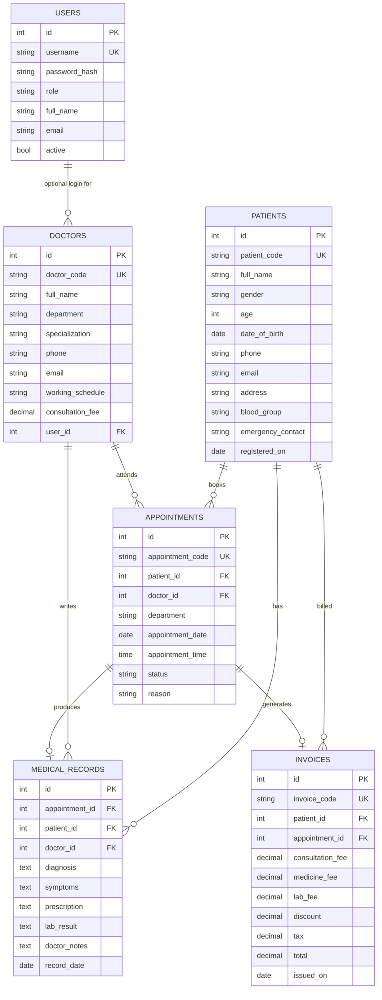

# Entity-Relationship Diagram

Matches both `src/main/resources/sql/schema.sqlite.sql` (runtime) and `sql/mysql_schema.sql` (production).

## Constraints worth calling out

- `appointments` has `UNIQUE (doctor_id, appointment_date, appointment_time)` — the database-level backstop for the no-double-booking rule (the primary check happens in `AppointmentService.bookAppointment()`).
- All foreign keys from `appointments`/`medical_records`/`invoices` to `patients`/`doctors` cascade or null-out on delete, matching the code's confirm-before-delete UX in `PatientController`/`DoctorController`.
- Indexes: `patients.full_name`, `doctors.department`, `appointments.appointment_date`, and a composite `(doctor_id, appointment_date)` index support the search/filter/sort operations used throughout the UI.
