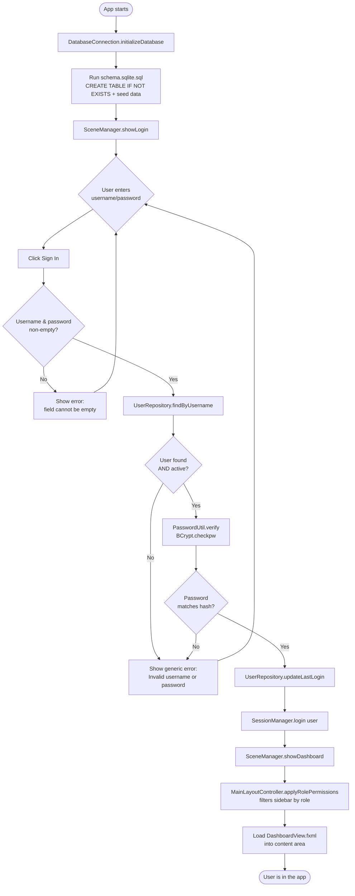

# Flowchart: Login & Startup Flow

## Notes

- The "generic error" branch for both *user not found* and *wrong password* is deliberate: it prevents username enumeration (an attacker can't tell whether a username exists by observing different error messages).
- Every step after `Submit` that touches the database is wrapped in a try/catch in `LoginController.handleLogin()`; any unexpected exception falls through to a generic "Unable to sign in right now" message rather than crashing the UI or leaking a stack trace to the user.
