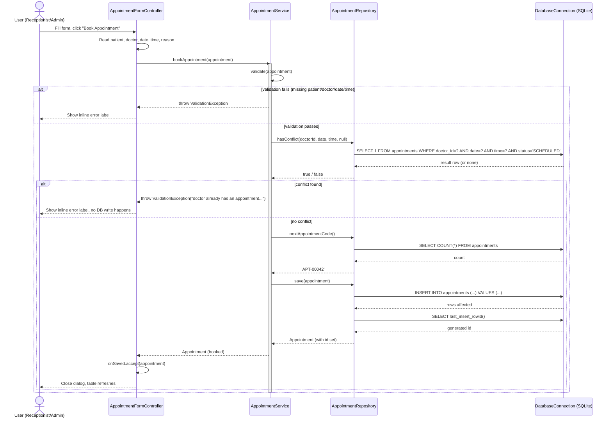

# Sequence Diagram: Booking an Appointment

The most business-rule-heavy flow in the system — chosen because it best shows the
Controller → Service → Repository → Database layering plus the conflict-prevention rule.

## Why the conflict check happens twice (service + schema)

1. **Service layer** (`AppointmentRepository.hasConflict`): the primary check — runs *before* any write, lets the app show a friendly `ValidationException` message instead of a raw SQL error.
2. **Schema constraint** (`UNIQUE (doctor_id, appointment_date, appointment_time)`): the backstop — protects data integrity even if two requests race past the first check (not possible in this single-connection desktop build, but this is the same pattern you'd want if the app were ever extended to a multi-client server).
