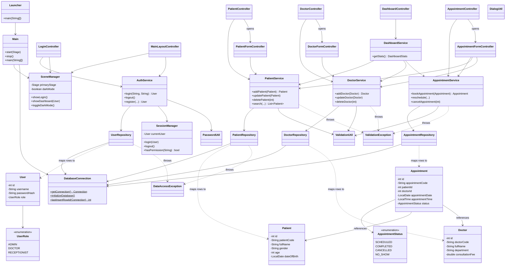

# UML Class Diagram

Rendered with [Mermaid](https://mermaid.js.org/) — view in GitHub, Obsidian, VS Code's Mermaid preview, or paste into https://mermaid.live.

## Design notes

- **MVC**: `controller/` = Controller, `model/` = Model, `fxml/` + `css/` = View.
- **Layering**: Controller → Service → Repository → DatabaseConnection. Controllers never touch JDBC directly; repositories never contain business rules (e.g. the double-booking check lives in `AppointmentService`, not `AppointmentRepository`).
- **Single Responsibility**: each repository handles exactly one table's CRUD; each service owns exactly one module's business rules; each controller wires exactly one FXML view.
- **Encapsulation**: all model fields are private with JavaFX property accessors (`xProperty()`) for TableView binding.
- **Polymorphism/Interfaces**: `UserRole` and `AppointmentStatus` enums drive `switch` expressions in `SessionManager.hasPermission()` and CSS badge styling, rather than scattering `if/else` chains.
