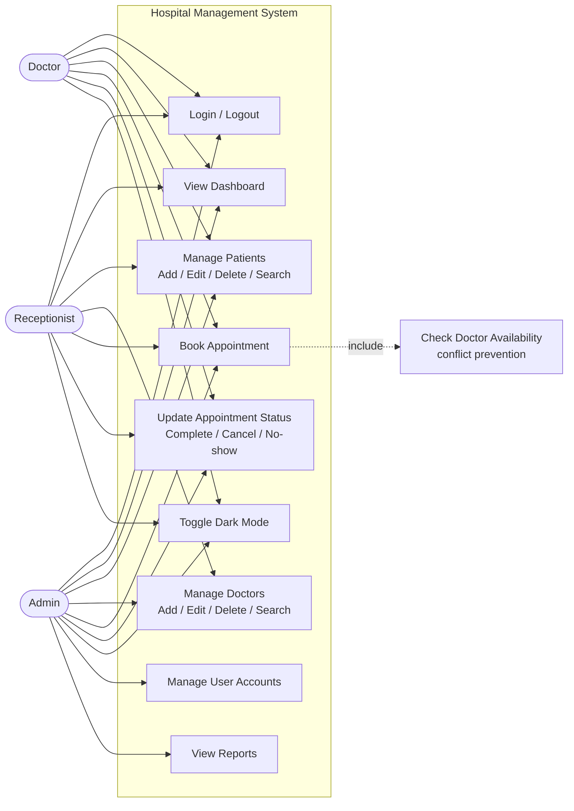

# Use Case Diagram

## Notes on role permissions (enforced in `SessionManager.hasPermission`)

- **Admin**: unrestricted access to every module, including user account management and reports (both are admin-only in the permission matrix).
- **Doctor / Receptionist**: dashboard, patients, and appointments. Doctor/Receptionist-specific restrictions (billing for receptionists, medical records for doctors) are defined in the permission matrix and ready to enforce once those modules' UIs are built.
- User account management and reports are gated to Admin only; this build's `MainLayoutController` currently shows Dashboard/Patients/Doctors/Appointments to all logged-in roles per the simplified module set delivered (see root `README.md`), with the permission matrix in `SessionManager` already in place for when Reports/User Management UI is added.
